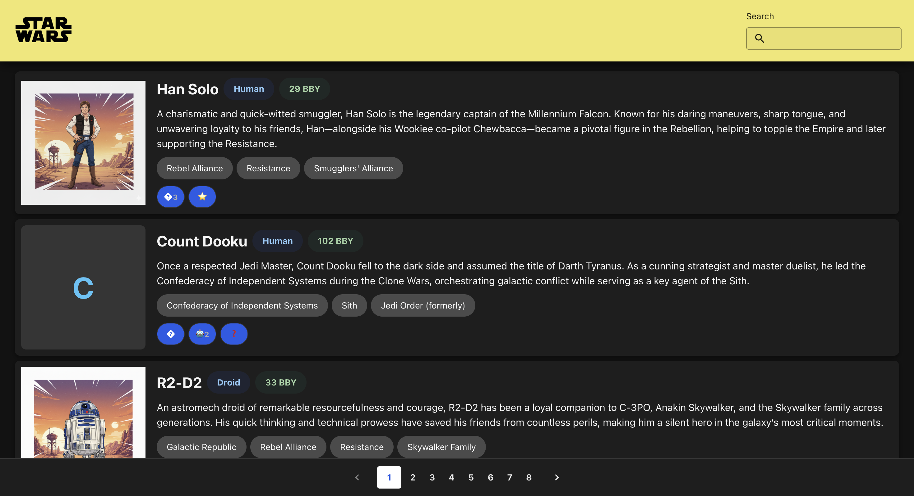

# Star Wars Frontend Test

**Live demo:** https://star-wars-frontend-test-hazel.vercel.app/

## Introduction

A small frontend application that lists Star Wars characters, built with React and TypeScript.

## Description

The application retrieves data from a local mock API and renders a searchable, paginated list of characters. The main page:
- Lets the user search for a character by typing in the Search field and hitting enter. Results show characters whose name starts with the entered text, 4 per page.
- Shows a pagination system at the bottom of the page to browse through more results.
- Fetches each character's reactions from a second API endpoint and displays them alongside the character.

### Screenshot

Each result displays:
- Character's image
- Character's name
- Character's description
- Character's species, birth year, affiliations.

The Pagination component is present at the bottom of the page.



## Stack

*   HTML
*   JavaScript / TypeScript
*   React JS
*   SCSS
*   Yarn
*   Vite

As for the components library, this project uses [@lumx/react](https://design.lumapps.com/), an open source React design system.

## Setup

In the project directory, run: `yarn`
This will set up the necessary dependencies to execute this project.

This project needs Node JS v.20.11.1 to run. Not doing so will result in an error. You can install this particular version using [nvm](https://github.com/nvm-sh/nvm).

> **Note:** The version of Vite included in this project's dependencies requires Node.js v20.19+ or v22.12+, which is incompatible with the v20.11.1 specified above. This project runs correctly with **Node v22**:
> ```
> nvm install 22
> nvm use 22
> ```

To start development, run `yarn start`, which will run the app in development mode.

---

## Implementation notes

### Features implemented
- **Search**: real-time search with 300ms debounce as the user types, also triggered on Enter. Results filter characters whose name starts with the entered text.
- **Character list**: displays 4 results per page, each card shows image, name, description, species, birth year, affiliations and reactions.
- **Reactions**: fetched from the `/api/reactions` endpoint, grouped by emoji (duplicate reactions show a count), deleted reactions are filtered out.
- **Pagination**: fixed at the bottom of the viewport, updates the list without full page reload.
- **Clear search**: button appears inside the search field when there is text, resets results on click.

### Edge cases handled
- Loading state (spinner while fetching)
- Empty state (message when no results are found)
- Error state (message if the API call fails)
- Characters with missing optional fields (image, description, birth year)
- Duplicate reaction IDs in the API data
- Single fetch per search query change (no double-fetch race condition)

### Tech decisions
- **@lumx/react** design system used for `Chip`, `Button`, `TextField`, `ProgressCircular` and other components.
- **CSS Modules** with SCSS for component-scoped styles and a dark theme defined via CSS custom properties in `index.scss`.
- **Mock Service Worker (MSW)** intercepts API calls in the browser — no backend required.
- **Responsive design**: cards switch to a vertical layout (image on top) on screens narrower than 600px.
- Custom `useDebounce` hook extracted for reusability.
